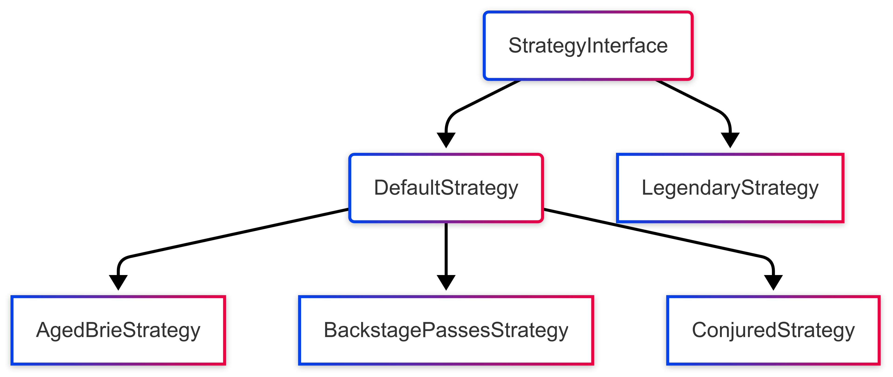

# Gilded Rose refactoring
This is my implementation of the Gilded Rose refactoring.
Starting point: [Gilded Rose class](src/main/java/com/gildedrose/GildedRose.java)
As a solution I am using the Strategy pattern with 2 root points and one base interface as such:



With as main entry point the [StrategyService](src/main/java/com/gildedrose/strategy/StrategyService.java).

This keeps the code:
- extensible, you only need to add a new service and extend the StrategyService without modifying existing code.
- responsible for one principle, each service only needs to cover one strategy/use case keeping each logic in their own classes.
- unknowing about the underlining implementations. Because each strategy implements the root Strategy interface, the code only needs to call the updateItem method after choosing the strategy.

### Testing
For testing, I'm using the Given When Then structure.
I find this way of testing more clear, you can clearly explain your expectations with your test code.

Normally you use a framework for this but to keep it simple I'm using the method names.

### Golden test
Is a means to describe (characterize) the actual behavior of an existing piece of software, and therefore protect existing behavior of legacy code against unintended changes via automated testing.

source: [wiki](https://en.wikipedia.org/wiki/Characterization_test)

### Legendary Item logic

Added a ```possibleFixLegendaryItem``` method to the LegendaryStrategy to have a control method whenever the quality of the legendary changed.
This should never happen, so I added a class that checks this and logs this and sets the quality method back to the valid number.
So the application can keep functioning, but we are informed about this possible issue, and we can do something about it.

# Project management

This kata is tracked by this Trello kanban board: [Kanban Board](https://trello.com/invite/b/67fa2835db3fb7b5dd911c0c/ATTIf20112eaff94162ff3b51cfde195edde80434B52/kata)

The git commits are structed with the kata-[ticket number] [title], so you can follow the linked tickets on the kata board.

The kanban tickets with blue labels are kata-Typescript only.

You can also see the public repo here: [kata-java](https://github.com/BramDeCneudt/kata-java)

# Gilded Rose Requirements Specification

Hi and welcome to team Gilded Rose. As you know, we are a small inn with a prime location in a
prominent city ran by a friendly innkeeper named Allison. We also buy and sell only the finest goods.
Unfortunately, our goods are constantly degrading in `Quality` as they approach their sell by date.

We have a system in place that updates our inventory for us. It was developed by a no-nonsense type named
Leeroy, who has moved on to new adventures. Your task is to add the new feature to our system so that
we can begin selling a new category of items. First an introduction to our system:

- All `items` have a `SellIn` value which denotes the number of days we have to sell the `items`
- All `items` have a `Quality` value which denotes how valuable the item is
- At the end of each day our system lowers both values for every item

Pretty simple, right? Well this is where it gets interesting:

- Once the sell by date has passed, `Quality` degrades twice as fast
- The `Quality` of an item is never negative
- __"Aged Brie"__ actually increases in `Quality` the older it gets
- The `Quality` of an item is never more than `50`
- __"Sulfuras"__, being a legendary item, never has to be sold or decreases in `Quality`
- __"Backstage passes"__, like aged brie, increases in `Quality` as its `SellIn` value approaches;
    - `Quality` increases by `2` when there are `10` days or less and by `3` when there are `5` days or less but
    - `Quality` drops to `0` after the concert

We have recently signed a supplier of conjured items. This requires an update to our system:

- __"Conjured"__ items degrade in `Quality` twice as fast as normal items

Feel free to make any changes to the `UpdateQuality` method and add any new code as long as everything
still works correctly. However, do not alter the `Item` class or `Items` property as those belong to the
goblin in the corner who will insta-rage and one-shot you as he doesn't believe in shared code
ownership (you can make the `UpdateQuality` method and `Items` property static if you like, we'll cover
for you).

Just for clarification, an item can never have its `Quality` increase above `50`, however __"Sulfuras"__ is a
legendary item and as such its `Quality` is `80` and it never alters.

